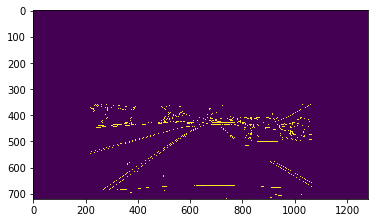
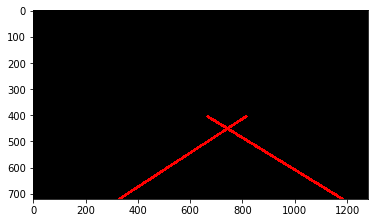
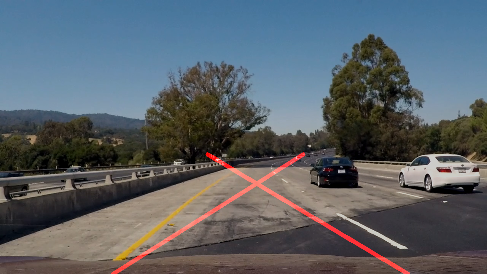

# **Finding Lane Lines on the Road** 

Notice: all source code is inside P1_project_code.ipynb
---
**Finding Lane Lines on the Road**

The goals / steps of this project are the following:
* Make a pipeline that finds lane lines on the road
* Reflect on your work in a written report

[//]: # (Image References)

[image1]: ./examples/grayscale.jpg "Grayscale"

---

### Reflection

### 1. Describe your pipeline. As part of the description, explain how you modified the draw_lines() function.

My pipeline consisted of 10 steps.

1. Convert the input image to grayscale image
2. Add Guassian smooth on top of the image 
3. Use Canny to detect edge of the image
4. Crop the image, leave only the region of interest of image, then use HoughLinesP to get the hough lines.
5. Divide the hough lines into two parts, one belongs to the left side, the other belongs to the right side.
6. For each side of hough lines, filter out by check abs(slope) > 0.5 and abs(slope) < 0.8
7. For each side of all the hough lines, calculate the mean of (x1, y1), (x2, y2).
8. Based on the result from step 7, calculate slop and offset of the line function for each side of the lines (right/left)
9. Calculate the start point and end point for each line by using the line function from step 8.
10. Draws lines via start/end point got from step 9.

### 2. Identify potential shortcomings with your current pipeline

1. Canny will return not only the lines we need but also lots of other noises

canny

2. HoughLinesP will return not only the lines we need but also lots of other noises which makes the final result always have an offset to the actual result 

hough line (by calculate the mean of x1,y1,x2,y2):

3. When processing the challenge.mp4, if the frame has a shadow, the result became very inaccurate

"challenge"

### 3. Suggest possible improvements to your pipeline

1. Might be some advanced technology to get canny edge?
2. Might be able to find better parameters for HoughLinesP?
